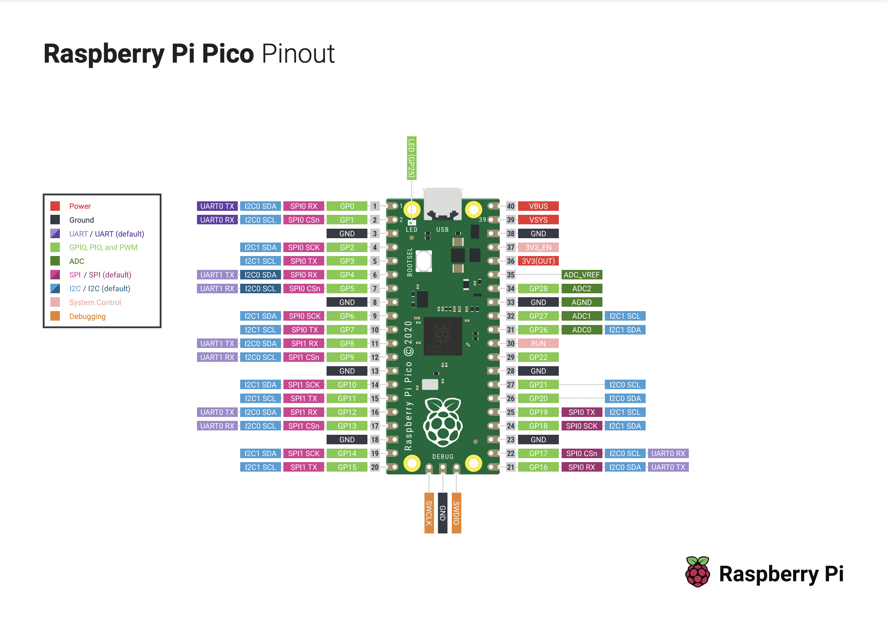

# nonstop_kfai
One station. One volume.

## Intro
You will set up a tiny little analog radio that's powered by a microcontroller. The radio module has a built in FM reciever and a 1/8" headphone jack output. You can listen to the radio without Wi-Fi when it's all assembed and powered on. It's kinda funny when you think about it - a computer powering an analog radio that doesn't need Wi-Fi. Whatever. The radio is set to one station (KFAI of course) and you cannot change that or the volume.

## What This Kit Includes
- 1x Raspberry Pi Pico H
- 1x Breadboard
- 1x Scoutmakes FM Radio Board
- 1x Micro USB/USB C Cable
- 1x Pair of Earbuds
- Jumper wire

## More on the Individual Components
### Raspberry Pi Pico pre-mounted on a breadboard
Raspberry Pi makes wonderful little computers for hobbyists. [The Pico is their microcontroller](https://www.raspberrypi.com/documentation/microcontrollers/raspberry-pi-pico.html), a small but powerful integrated circuit that has tons of open source support, projects, and help. It is the brains of our project, and where the software runs. It communicates with the two attached devices, the APDS-9960 and the TRRS Jack.

All the actual programming and software is done, so you’ll only need to worry about the assembly. But, knowing how the guts work is half the fun. The software only uses a few of the pins on the Pico for this project: the 3V3 power output and ground pins to pull electricity through the circuit, the SDA and SCL pins to communicate with the APDS-9960, and a general purpose pin to output the audio.

[The Pico is already embedded in a breadboard](https://learn.sparkfun.com/tutorials/how-to-use-a-breadboard/all?gad_source=1&gclid=CjwKCAjwg8qzBhAoEiwAWagLrCOuPgeaCGzUKGcsefkz8sO2QxBlmTG8HAUSbq4eaGX5hsJnfJ0WjBoCZXoQAvD_BwE), a small development board that lets you easily assemble electronics without solder. The breadboard I’ve included is printed specially for the Pico, you’ll note that each row on the board is numbered/lettered to correspond to the pinout diagram.

### Scoutmakes FM Radio Module
[This is a nice little radio module.](https://www.adafruit.com/product/5651) It has a HUGE software library and you can use it to build a really sophisticated little radio. We're ascending to a higher plane of consciousness and using a sliver of its potential to play the only radio that matters... jk SKOR North is cool too shout out to Phil Mackey.

## Assemble the Radio for Nonstop KFAI
1. Plug the Radio Module into Column C. The GND pin should be in Row 26 and the SCL pin should be in row 29, the headphone jack should hang over the edge of the breadboard

*The headphone jack is a beefy little boy, so I let mine hang off the edge*
2. Power and ground the radio

*We need to send power to the radio from the Pico*
    * Connect Column B Row 26 (GND pin) to Column B Row G
    * Connect Column B Row 27 (VCC pin) to Column I Row 3v
3. Connect serial data and serial clock lines

*This lets the microcontroller tell the radio which station to tune itself to. There is only one*
    * Connect Column B Row 28 (SDA pin) to Column B Row 5
    * Connect Column B Row 29 (SCL pin) to Column B Row 6
4. Attach antenna to the pot if you need a signal boost.

*I didn't solder this in, you can if you want to. Or you can strip back the wire a little and just hand tighten it around the pot*
5. Plug the Micro USB into the Pico and the other end into a power source (computer, portable battery, power brick, etc). A green red light on the radio module should turn on if everything is plugged in right
6. Plug in your headphones into the TRRS Jack and the other end into your ears - you might need to only plug in your headphones ¾ of the way in (if they have a microphone)
7. Enjoy Nonstop KFAI

## Troubleshooting
I tested all the components and the Pico’s, so you shouldn’t have a hardware issue. If you’ve wired up the the components right, it should work when you plug everything in. Some common solutions to frequent problems that I’ve definitely had are:
- Make sure all your components are plugged in snuggly
- Make sure the right pins on the Pico are connected to the right SCA/SCL pins
- Fiddle with the headphones a little, maybe plug them in more or less. It is your life you need to live it.

## Advanced
Now you have yourself a working gizmo! You might be content to leave it there, you might have caught the bug and want to try to do more. Programming microcontrollers can be as simple or as complex as you’d like it to be. You have the source code for this project, and a controller that’s already set up to run it. You can edit the source code and flash it onto the Pico’s memory, make your own variation on the radio. You can take this all apart, blank the flash memory, and build something new from scratch. You can throw it all away and start reading Lord of the Rings.

This project was built with Adafruit’s Circuit Python on a Raspberry Pi Pico. If you want to learn more, start pulling on either of those threads and enjoy.

## This is only possible with the great work of literally everyone else
This uses some Circuit Python and some community libraries
- https://circuitpython.org/libraries
Bunch of real ones also made a library to support the radio
- https://learn.adafruit.com/scoutmakes-fm-radio-board-stemma-i2c/circuitpython-code

## Starting up from scrach with a brand new Pico?
I'll be real with you, I'm gonna be super vauge here and just give you the broad strokes of what you need to do. How you do it is entirely up to you.
1. Load the circuit python firmware onto your pico (you can get this from Adafruit directly or use the version I have in the repo)
1. Load up the radio library by dragging this `tinkeringtech_rda5807m` from the repo the Pico's `lib` directory, or get one from the community bundle
1. Flash code.py onto the pico
1. Hook it up.
1. Plug it in.
1. Crank it.

